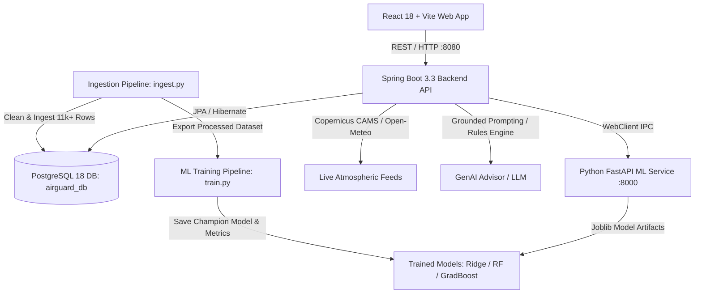

# AirGuard AI — Intelligent Air Quality Prediction & Advisory Platform

[](https://spring.io/projects/spring-boot)
[](https://fastapi.tiangolo.com)
[](https://reactjs.org)
[](https://www.postgresql.org)
[](https://scikit-learn.org)
[](https://tailwindcss.com)

**AirGuard AI** is a production-grade full-stack platform that combines **empirical atmospheric data science**, **machine learning regression**, **grounded generative AI explanations**, and **modern interactive data visualizations** to forecast urban Air Quality Index (AQI) and deliver evidence-based environmental-health guidance.

---

## Architecture & Data Flow



---

## Key Features

1. **Live Air Quality Telemetry & Interactive Gauge**:
   - Real-time station tracking for Delhi, Mumbai, Bengaluru, London, and New York.
   - Dynamic circular SVG progress gauge displaying US EPA AQI category and color benchmarks.
   - Criteria pollutant cards (PM2.5, PM10, NO2, SO2, CO, O3) with WHO/EPA reference thresholds.
2. **AI + ML Forward-Looking Forecast**:
   - Out-of-sample AQI regression predictions for next 24-hour horizons.
   - Statistical 95% prediction intervals derived from test residual variance ($\pm 1.96 \times \text{RMSE}$).
   - Historical vs forecast continuous curve transitions.
   - Grounded "Why is AQI expected to change?" natural-language explanations.
   - Major model contributing factor rankings (% feature importance attribution).
3. **Criteria Pollutants Deep-Dive**:
   - Physiological impacts, toxicology explanations, and health benchmark comparison tables.
4. **Multi-City Comparison Matrix**:
   - Select 2 or 3 global cities side-by-side with grouped bar charts and automated comparative analysis.
5. **"Ask AirGuard" Contextually Grounded Conversational AI**:
   - Natural language Q&A assistant grounded in real-time telemetry (zero statistical hallucination).
   - Demographic health guidance switcher (General public, Sensitive groups, Children/Elderly, Outdoor athletes).
   - Explicit environmental health advisory notice and clinical disclaimer.
6. **Model Governance & Benchmark Page**:
   - Empirical evaluation comparison matrix (Baseline Ridge vs Random Forest vs Gradient Boosting).
   - Visual comparison charts for MAE, RMSE, and $R^2$.
7. **Persistence & Audit Log**:
   - Save favorite monitoring stations and audit previous forecast runs persisted in PostgreSQL.

---

## Tech Stack

| Layer | Technologies |
| :--- | :--- |
| **Frontend** | React 18, Vite, Tailwind CSS, Recharts, Lucide React, Axios, React Router v6 |
| **Backend** | Java 17 / 23, Spring Boot 3.3, Spring Web, Spring Data JPA, Spring WebFlux |
| **Database** | PostgreSQL 18 (Optimized with composite B-tree indexing) |
| **Machine Learning** | Python 3.13, Scikit-learn, XGBoost / GradientBoosting, Pandas, NumPy, Joblib |
| **ML Serving** | FastAPI, Uvicorn (REST microservice on `:8000`) |
| **Generative AI** | Google Gemini API / Configurable LLM with fallback rule-based expert engine |
| **Containerization** | Docker, Docker Compose |

---

## Machine Learning Pipeline & Benchmark

### Objective:
Predict the Air Quality Index for the next 24-hour horizon ($t + 24$) from past atmospheric criterion concentrations and meteorological variables.

### Engineered Features:
- **Cyclical hour**: $\sin(2\pi \cdot \text{hour} / 24)$ and $\cos(2\pi \cdot \text{hour} / 24)$.
- **Autoregressive lags**: 1-hour and 24-hour lags of PM2.5, PM10 (`shift(1)`, `shift(24)`).
- **Moving statistics**: 6-hour moving average (`pm25_roll_mean_6h`) and 24-hour baseline (`aqi_roll_mean_24h`).
- **Meteorological drivers**: Surface temperature, humidity, and wind dispersion velocity.

### Out-of-Sample Empirical Evaluation:

| Architecture | MAE (AQI) | RMSE (AQI) | $R^2$ Score | Status |
| :--- | :---: | :---: | :---: | :---: |
| **Baseline (Ridge Regression)** | **17.50** | **26.58** | **0.6299** | **Selected Champion** |
| **Gradient Tree Boosting** | 17.54 | 35.60 | 0.3364 | Evaluated |
| **Random Forest Regressor** | 18.23 | 36.71 | 0.2942 | Evaluated |

*Validation Split: Strict temporal chronological split (earliest 80% train, latest 20% holdout per station; zero data leakage).*

---

## Quick Start & Local Setup

### Prerequisites:
- JDK 17 or JDK 23
- Apache Maven 3.9+
- Python 3.11+
- Node.js v20+ and npm
- PostgreSQL 16+ running on port 5432

---

### Step 1: Initialize Database & Ingest Data

```bash
# 1. Initialize schema in PostgreSQL
python data/init_db.py

# 2. Ingest authentic historical observations across 5 cities
python data/ingest.py

# 3. Train and persist machine learning models
python ml-service/train.py
```

---

### Step 2: Launch FastAPI ML Service (:8000)

```bash
cd ml-service
python -m uvicorn src.main:app --host 127.0.0.1 --port 8000
```
*Health Check: http://127.0.0.1:8000/health*

---

### Step 3: Launch Spring Boot Backend (:8080)

```bash
cd backend
mvn clean package -DskipTests
java -jar target/airguard-backend-1.0.0.jar
```
*API Base: http://localhost:8080/api/cities*

---

### Step 4: Launch React Frontend (:5173)

```bash
cd frontend
npm install
npm run dev
```
*Open in Browser: http://localhost:5173/*

---

## Running with Docker Compose

To spin up the entire multi-container stack with a single command:

```bash
docker compose up --build
```
- Frontend UI: `http://localhost:5173`
- Backend REST API: `http://localhost:8080/api`
- FastAPI ML Service: `http://localhost:8000/docs`
- PostgreSQL: `localhost:5432`

---

## Project Structure

```
AirGuard AI/
├── backend/                  # Spring Boot 3.3 Core Backend
│   ├── src/main/java/com/airguard/
│   │   ├── config/           # CORS, WebClient configs
│   │   ├── controller/       # City, AirQuality, Prediction, AI, Favorite controllers
│   │   ├── dto/              # Unified API and Transfer Contracts
│   │   ├── entity/           # JPA Entities (City, AirQualityRecord, PredictionRecord, etc.)
│   │   ├── exception/        # Centralized RestControllerAdvice and custom exceptions
│   │   ├── repository/       # Spring Data Repositories with custom JPQL queries
│   │   └── service/          # AirQualityService, MLServiceClient, AIService, AQICalculator
│   ├── src/main/resources/   # application.yml
│   ├── Dockerfile
│   └── pom.xml
├── ml-service/               # Python FastAPI Machine Learning Microservice
│   ├── data/                 # Processed training datasets
│   ├── models/               # Serialized Joblib models and metrics.json
│   ├── notebooks/            # Standalone EDA_and_Modeling.ipynb notebook
│   ├── src/                  # FastAPI main.py, model manager, feature engineering, EPA standards
│   ├── Dockerfile
│   ├── requirements.txt
│   └── train.py              # Model training and comparative evaluation script
├── data/
│   ├── init_db.py            # Automated PostgreSQL database & table initialization
│   ├── ingest.py             # Data ingestion pipeline fetching Copernicus/Open-Meteo feeds
│   └── air_quality_master.csv# Exported clean multi-city atmospheric dataset
├── frontend/                 # React 18 + Vite + Tailwind CSS Single-Page Application
│   ├── src/
│   │   ├── api/client.js     # Axios client communicating with Spring Boot backend
│   │   ├── components/       # Navbar, Footer, AqiGauge, PollutantCard, TrendBadge, etc.
│   │   ├── pages/            # Dashboard, Forecast, Pollutants, Compare, Advisory, ModelInsights, History
│   │   ├── App.jsx
│   │   └── index.css
│   ├── Dockerfile
│   ├── package.json
│   └── vite.config.js
├── docs/
│   ├── ARCHITECTURE.md       # Detailed architectural specifications
│   ├── ER_DIAGRAM.md         # Database relational model and indexing rationale
│   ├── API_DOCUMENTATION.md  # Comprehensive REST API reference with sample payloads
│   ├── INTERVIEW_GUIDE.md    # 20+ Placement interview questions and defensible answers
│   └── schema.sql            # PostgreSQL DDL script
├── docker-compose.yml
├── .env.example
├── .gitignore
└── README.md
```

---

## Placement Interview Highlights

Check out [docs/INTERVIEW_GUIDE.md](docs/INTERVIEW_GUIDE.md) for complete technical answers to the top 20 placement questions, including:
1. Why AQI prediction is formulated as a regression problem rather than classification.
2. How data leakage was strictly eliminated in time-series rolling statistics.
3. Why machine learning performs numerical prediction while Generative AI performs explanation.
4. How context-grounded prompting prevents statistical hallucination.
5. Why PostgreSQL with composite B-tree indexing was selected over flat files.
6. How Spring Boot orchestrates asynchronous microservice communication with resilient fallbacks.

---

## License

This project is open-source under the [MIT License](LICENSE).
Official meteorological and atmospheric data is powered by the Copernicus Atmosphere Monitoring Service (CAMS) and Open-Meteo under open-data terms.
