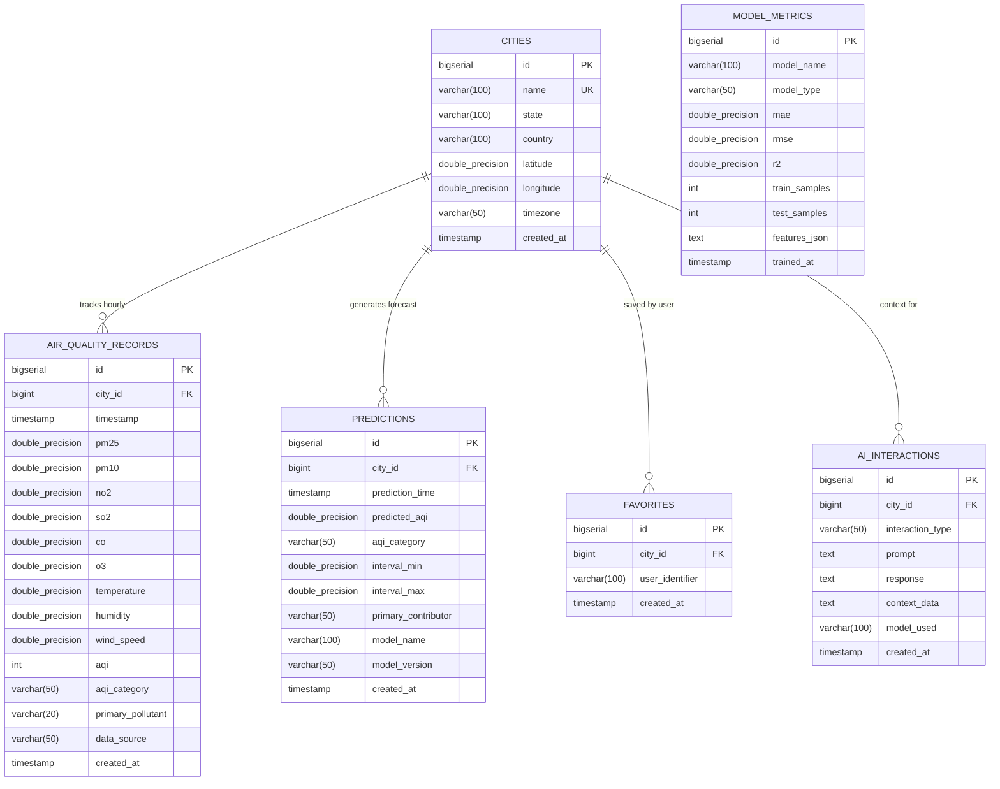

# AirGuard AI: Entity-Relationship (ER) Documentation

## Database Schema Diagram

---

## Indexing & Performance Design Decisions

1. **`idx_aq_city_timestamp` on `air_quality_records(city_id, timestamp DESC)`**:
   - **Rationale**: Most frequent analytical queries filter by a specific city and require recent time slices (e.g. `WHERE city_id = ? ORDER BY timestamp DESC LIMIT 72`). This composite B-tree index avoids full table scans and serves index-only scans for chronological sorting.
   - **Cardinality**: `city_id` provides initial partition pruning; `timestamp DESC` enables logarithmic seek to latest sensor events.

2. **`uq_city_timestamp` UNIQUE constraint on `(city_id, timestamp)`**:
   - **Rationale**: Enforces data idempotency during batch ingestion (`ON CONFLICT (city_id, timestamp) DO UPDATE`). Guarantees no duplicate telemetry rows exist for identical observation hours.

3. **`idx_pred_city_time` on `predictions(city_id, prediction_time DESC)`**:
   - **Rationale**: Accelerates forecast audit retrieval and enables fast lookup of future expected AQI horizons.
